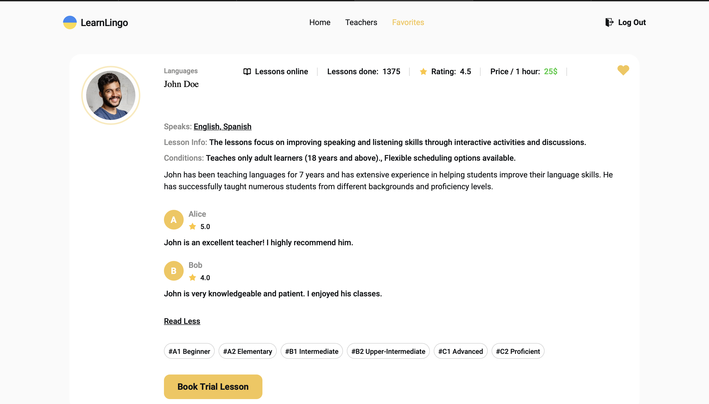

## LearnLingo

This website is dedicated to providing online language learning services through experienced teachers. Learn Lingo offers a diverse selection of language courses tailored to meet the needs of students at all levels. Our goal is to create an engaging and personalized learning experience, empowering users to achieve their language goals and explore new cultures with confidence.

When a user accesses the homepage, they will have the opportunity to register through a signup form, which may include fields such as name, email, and password. Once the registration is complete, the user can access the site's features. A special feature of the homepage is that, each time the page is reloaded or refreshed, the image and button change color.

On the Teachers page, users can filter the list of teachers based on various criteria such as language, level, and price. Each teacher's profile displays important details like their name, rating, and lesson information. Users have the option to add teachers to their Favorites by clicking on the heart icon, but this feature is only available to registered users. If an unregistered user tries to add a teacher to their favorites, they will be prompted to register or log in.

Once the user has registered and logged in, they will have full access to all the site's features. After registration, the user will be redirected to the Favorites page, where they can view all the teachers they have added to their favorites list. This page makes it easy to manage favorites, simplifying the process of booking lessons or reviewing teacher details.

In summary, registration unlocks the ability to add teachers to favorites and provides full access to the Favorites page.

    
    

## Tools and technologies I utilized

